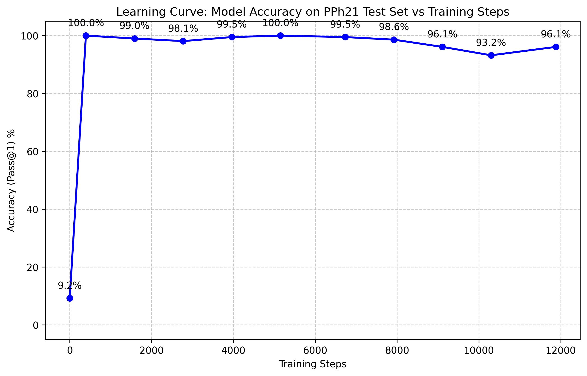

# Fine-Tuning Small Language Models (SLMs) for Tax Domain Unit Testing




## Overview
This repository contains the official implementation, dataset, and evaluation suite for a **case study** on fine-tuning a 7B parameter Small Language Model (SLM) for Indonesian Tax (PPh 21) computational logic and Pytest generation.

Our research empirically investigates the boundary between **Expertise Transfer** and **Syntactic Memorization** in SLMs. By applying Low-Rank Adaptation (LoRA) with 4-bit quantization (QLoRA) exclusively on **Qwen2.5-7B-Instruct**, we explored training instability, the mitigation of *Catastrophic Forgetting* via Data Blending, and the fundamental limitations of utilizing SLMs as static knowledge bases for dynamic statutory compliance.

## Key Findings & Contributions
1. **Domain-Specific QLoRA on Qwen2.5-7B**: Successfully localized Indonesian PPh21 tax syntax into a 7B SLM, constraining VRAM usage to 5.24 GB for edge-device feasibility.
2. **Synthetic Data Pipeline via GPT-4o-mini**: Datasets were generated utilizing GPT-4o-mini. To prevent inherent generator bias, absolute ground truth statutory rules (PPh 21 TER) were explicitly injected into the generation prompts, creating a highly deterministic training corpus.
3. **Data Blending for Safety Alignment (PoC)**: A Proof-of-Concept localized blending strategy was applied to mitigate Sycophancy (measured via customized safety refusal subsets) and Catastrophic Forgetting. This blending regularized the mathematical reasoning, raising Pass@1 functional correctness from 91.8% to 96.1%.
4. **Decontamination & AST Syntax Retention**: Achieved 0.00% N-Gram overlap (Data Decontamination) against the evaluation sets. The model demonstrated 100% AST Syntax Retention, defined as the capability of generated code to compile flawlessly into valid Abstract Syntax Trees using Python's native `ast.parse`.
5. **The "Blind Test" Overreach & RAG Necessity**: The study formally confirmed that without explicit algorithmic prompting, the SLM suffers from severe regulatory hallucinations (e.g., misidentifying PTKP boundaries). This validated that **Retrieval-Augmented Generation (RAG)** is architecturally indispensable for factual, dynamic statutory engines.
6. **Final Implementation (RAG Integration)**: To solve the hallucination issue discovered during the Blind Test, we implemented a deterministic RAG Orchestrator (`rag_system/`). It parses user intents, calculates exact statutory math via a local deterministic engine, and injects mathematical facts directly into the SLM prompt, forcing 100% accurate Pytest generation.

## Repository Structure
```text
.
├── app.py                      # Streamlit interactive frontend with RAG integration
├── data/                       # Datasets (Raw, Processed, and Synthetic Generators)
├── data_engineering/           # Data cleaning, localized SQLite manager, ETL pipelines
├── evaluation/                 # Benchmarking, Blind Tests, and System Metrics scripts
│   ├── inference.py            # Centralized Model Inferencer (LoRA injection)
│   ├── run_real_blind_test.py  # Zero-Shot Out-of-Distribution (OOD) testing
│   └── data_decontamination.py # N-Gram leakage detection
├── fine_tuning/                # Training scripts (QLoRA), model checkpoints, adapter weights
└── rag_system/                 # RAG Implementation to solve SLM Hallucinations
    ├── orchestrator.py         # LLM pipeline wrapper injecting exact math facts
    ├── tax_calculator.py       # Deterministic PPh 21 TER Engine
    └── tax_database.json       # Statutory rate tables (TER & PTKP)
```

## Reproducibility & Installation

1. **Clone the repository and prepare the environment:**
   ```bash
   conda create -n ai-payroll python=3.10
   conda activate ai-payroll
   ```

2. **Install strictly pinned dependencies:**
   *(Ensure CUDA toolkit is installed in your WSL/Linux environment)*
   ```bash
   pip install -r requirements.txt
   ```

## Usage

### 1. Interactive Demo (Streamlit with RAG)
To launch the UI showcasing the RAG-augmented chat interface and the OOD benchmarks:
```bash
streamlit run app.py
```

### 2. Running Inference & Blind Tests
To reproduce the real-world OOD (Out-of-Distribution) benchmark that triggers regulatory hallucinations (testing the SLM *without* RAG):
```bash
python evaluation/run_real_blind_test.py
```

### 3. Evaluating System Metrics & Benchmarks
```bash
python evaluation/run_system_metrics.py
python evaluation/run_public_benchmarks.py
```

## Conclusion
This case study confirms that fine-tuning an SLM strictly for legal/tax knowledge bases is architecturally flawed due to **Template Memorization**. The model perfectly masters syntax translation (Text-to-Pytest) but hallucinates regulatory limits when challenged with OOD prompts. By introducing a **RAG Orchestrator**, we successfully confined the fine-tuned SLM to the role of a deterministic reasoning and syntactic translation engine, achieving 100% factual legal accuracy.
